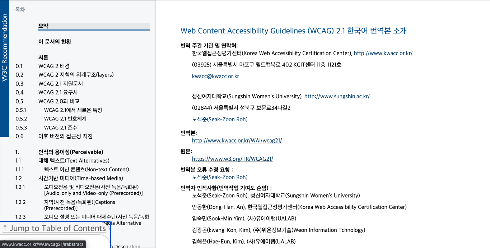
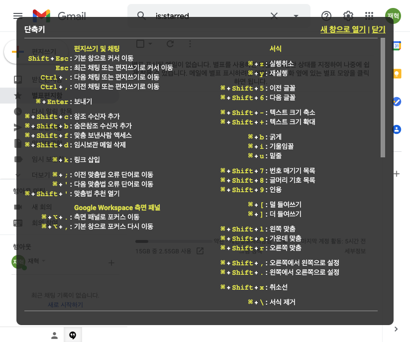
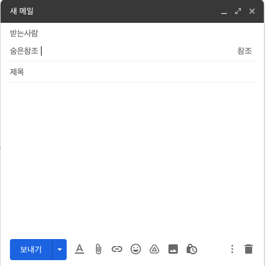

# 2. 운용의 용이성(Operable)

## 이 글의 목적과 순서

이 글에서는 W3C가 발행한 WCAG(Web Content Accessibility Guidelines) 중 두 번째 주제인 '운용의 용이성(Operable)'의 내용을 정리하고 해당 가이드라인을 잘 준수한 웹 사이트를 소개하고자 한다. 이 글은 다음의 순서로 전개해가고자 한다.

1. WCAG 중 운용의 용이성(Operable)을 준수하기 위한 기준 소개
1. 각 기준을 준수한 웹 사이트 소개

## 1. WCAG 중 운용의 용이성(Operable) 내용 소개

운용의 용이성은 해당 웹 페이지의 사용자 인터페이스를 구성하는 요소와 네비게이션이 운용 가능해야 함을 의미한다. 운용이 용이해야 함이 의미하는 것은 장애가 없는 일반인의 입장에서는 물론 시각, 청각, 지적 장애 등을 가지고 있는 장애인의 입장에서도 웹 페이지의 구성요소들에 접근하고 이용이 가능해야 한다는 것이다. WCAG에서는 운용의 용이성을 평가하는 기준을 다음과 같이 5가지로 제시하고 평가의 단계를 세 가지(A, AA, AAA)로 구분한다.

- 키보드 접근성(Keyboard Accessible)
- 충분한 시간(Enough Time)
- 발작 및 신체적 반응(Seizures and Physical Reactions)
- 네비게이션 가능(Navigable)
- 입력 방식(Input Modalities)

### 운용의 용이선 평가 기준 2.1 키보드 접근성(Keyboard Accessible)

키보드로 모든 기능을 사용할 수 있어야 한다. 이를 평가하는 세부 성공 기준은 아래와 같이 4가지로 나뉜다.

#### 성공 기준 2.1.1 키보드

- 설명

개별 키 입력을 위한 특정 타이밍이 요구되지 않는 키보드 인터페이스를 통해 모든 콘텐츠의 기능을 이용할 수 있어야 한다. 단, 콘텐츠의 기본 기능에 끝점(endpoints)뿐만 아니라 사용자의 이동 경로 입력이 필요한 경우는 예외로 한다.

> 참고 1
> 이 예외는 기본 기능과 관련되지만, 입력 기법은 아니다. 예를 들어 손글씨(handwriting로 텍스트를 입력한다면, 입력 기법(손기술)은 경로의존적인(path-dependent) 입력이 필요하지만, 기본 기능인 텍스트 입력은 경로의존적인 입력을 필요로 하지 않는다.

> 참고 2
> 이 성공기준은 키보드 조작 외에 마우스 입력이나 다른 입력 방법을 제공하는 것을 금지하지 않으며, 금지해서도 안 된다. 즉, 장애인/비장애인의 구분없이 해당 콘텐츠를 이용하는 데에 불편함이 없어야 한다.

- 사례: [W3 WCAG 페이지](https://www.w3.org/TR/WCAG21/)

_`Tab`키를 통한 사이드바 접근_

**성공 기준 2.1.1 키보드** 조건을 만족한 사례는 이 글의 참고 자료가 된 W3 WCAG 페이지이다. 페이지에 처음 들어가서 `Tab`키를 누르면 가이드라인의 목차로 이동가능한 영역이 포커스되며 Mac의 voice over와 같은 정보보조장치에 의해 해당 영역이 어떤 콘텐츠를 가지고 있는지를 알려준다.

- 위 조건 충족 시 level A

#### 성공기준 2.1.1 키보드 함정 방지

- 설명

키보드 인터페이스(가령 Tab 키)를 사용하는 키보드 포커스를 페이지의 구성요소로 이동할 수 있는 경우, 키보드 인터페이스만으로도 해당 구성요소에서 포커스를 이동시킬 수 있어야 한다. 수정되지 않은 화살표, 탭 키, 또는 다른 표준 종료 방법이 필요한 경우, 사용자에게 포커스를 이동시키는 방법에 대해 안내해야 한다.

> 참고
> 이 성공기준을 충족하지 못하는 콘텐츠는 모든 페이지를 사용하는 사용자들의 능력을 방해할 수 있다. 웹 페이지의 모든 콘텐츠는 다른 성공기준의 충족 여부와 관계없이 반드시 이 성공기준을 준수해야 한다.

- 사례1: [W3 WCAG 페이지](https://www.w3.org/TR/WCAG21/)

_`Tab`키를 통한 링크 접근 1_
.png>)

_`Tab`키를 통한 링크 접근 2_
.png>)

_`Tab`키를 통한 링크 접근 3_
.png>)

`Tab`키를 눌러 본문 콘텐츠에 접근하면 _링크 접근1_, _링크 접근2_, *링크 접근3*과 같이 콘텐츠에 포함된 링크를 위에서 아래로, 왼쪽에서 오른쪽으로 건너뛰며, 해당 영역이 다른 URL로 연결가능한 링크임을 알려준다. 키보드의 `Tab`키를 이용하여 링크와 같은 사용자와 인터렉티브한 콘텐츠에 접근가능함을 보여주는 사례다.

- 사례 2: [patientslikeme.com/symptoms](https://www.patientslikeme.com/symptoms)

_`Tab`키를 통한 콘텐츠 열기_
.png>)

`Tab`키를 눌러 해당 페이지의 콘텐츠에 접근하다보면, 위의 사진과 같이 원래는 가려져 있지만 `Tab`키를 눌러 숨겨져있던 아코디언 메뉴 형식의 콘텐츠를 확인할 수 있다. 해당 대메뉴에서 `Tab`키를 누르면 인터렉티브한 소메뉴에 접근할 수 있고 포커스된 콘텐츠에서 `Enter`키를 누르면 해당 콘텐츠 링크로 이동이 가능하다.

- 위 조건 충족시 Level A

#### 성공기준 2.1.3 키보드(예외 없음)

- 설명

콘텐츠의 모든 기능은 개별 키 입력에 대한 특정 시간종료(timeout)을 요구하지 않는 키보드 인터페이스를 통해 운용 가능해야 한다.

- 사례

위에서 제시한 사례 모두 개별 키 입력에 대한 특정 시간종료를 요구하지 않는다. 위의 사례가 이 조건의 사례가 될 수 있다.

- 위 조건 충족 시 Level AAA

#### 성공기준 2.1.4 문자 단축키

- 설명

키보드 단축키를 문자(대문자 및 소문자), 구두점, 숫자 또는 기호만 이용하도록 구현할 경우, 다음 중 하나 이상을 준수해야 한다.

| 준수사항                                         | 설명                                                                                                               |
| ------------------------------------------------ | ------------------------------------------------------------------------------------------------------------------ |
| **해제(Turn off)**                               | 단축키를 끌 수 있는 매커니즘을 제공해야 한다.                                                                      |
| **재설정(Remap)**                                | 하나 이상의 인쇄 불가능한 문자(가령, Ctrl, Alt 등)를 사용하여 단축키로 재설정(remap)하는 매커니즘을 제공해야 한다. |
| **포커스 시에만 활성화(Activate only on focus)** | 사용자 인터페이스 구성요소의 단축키는 해당 구성요소가 포커스 받았을 때만 활성화되어야 한다.                        |

- 사례: 구글 gmail

_구글 gmail 단축키_

_편지쓰기에서 숨은 참조 추가하기_

구글 gmail 설정에서 **키보드 단축키 사용**을 선택하고 gmail에서 `?`키를 클릭하면 gmail에서 사용가능한 모든 단축키를 확인할 수 있다.

모든 단축키는 `편지쓰기 및 채팅` 등의 구성요소가 포커스 받았을 때만 활성화되고 그 외의 구성요소(화면)에서는 해당 단축키는 작동하지 않는다. 이는 위의 준수사항에서 세 번째 `포커스 시에만 활성화` 조건을 준수한 사례이다.

- 위 조건 충족 시 Level A
