# Perceivable

## 1.1 충족 기준: Text Alternatives

> Provide text alternatives for any non-text content so that it can be changed into other forms people need, such as large print, braille, speech, symbols or simpler language.

간단하게 요약하자면, 텍스트로 이루어진 컨텐츠가 아닌 경우에는 대체 텍스트를 제공해야 한다는 것이다. 대체 텍스트를 제공해야 하는 이유는 다음과 같이 명시되어 있다.

<figure>
  <figcaption>[ Intent for Text Alternatives ]</figcaption>
  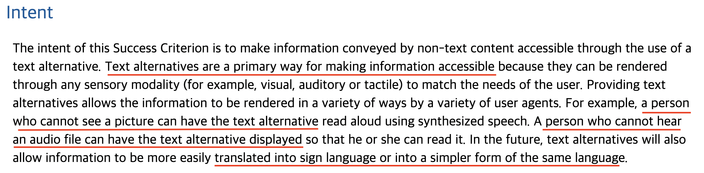
</figure>

위 설명을 보면 대체 텍스트는 어떠한 정보에 접근할 수 있는 가장 주가 되는 방법이고, 따라서 대체 텍스트를 통해서 청각 장애인이 소리 대신 텍스트로 정보에 접근할 수 있도록 하며 시각 장애인은 대체 텍스트를 읽어주는 보조 기기를 통해서 정보에 접근할 수 있도록 해줄 수 있다고 되어 있다.

<figure>
  <figcaption>[ Img with alt ]</figcaption>
  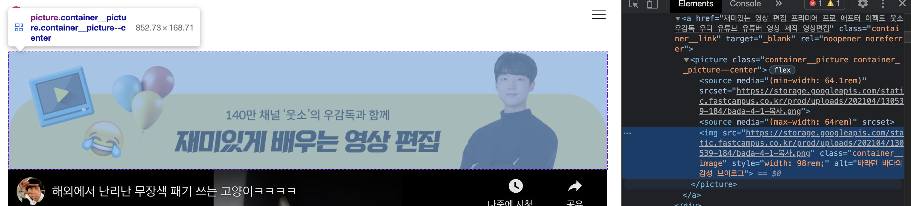
</figure>

위 사진처럼 alt 속성값으로 이미지에 대한 설명을 텍스트로 보충해주고 있는 모습을 볼 수 있다. 하지만 아래 이미지는 alt 속성값을 가지고 있지 않은 모습을 확인할 수 있다.

<figure>
  <figcaption>[ Img without alt ]</figcaption>
  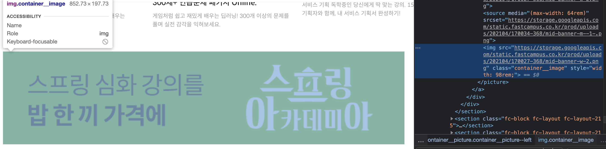
</figure>

### 1.1.1 충족 기준: Non-text Content

아래와 같은 데이터 차트가 있다고 가정해보자.

<figure>
  <figcaption>[ Sample Data Chart ] (W3C)</figcaption>
  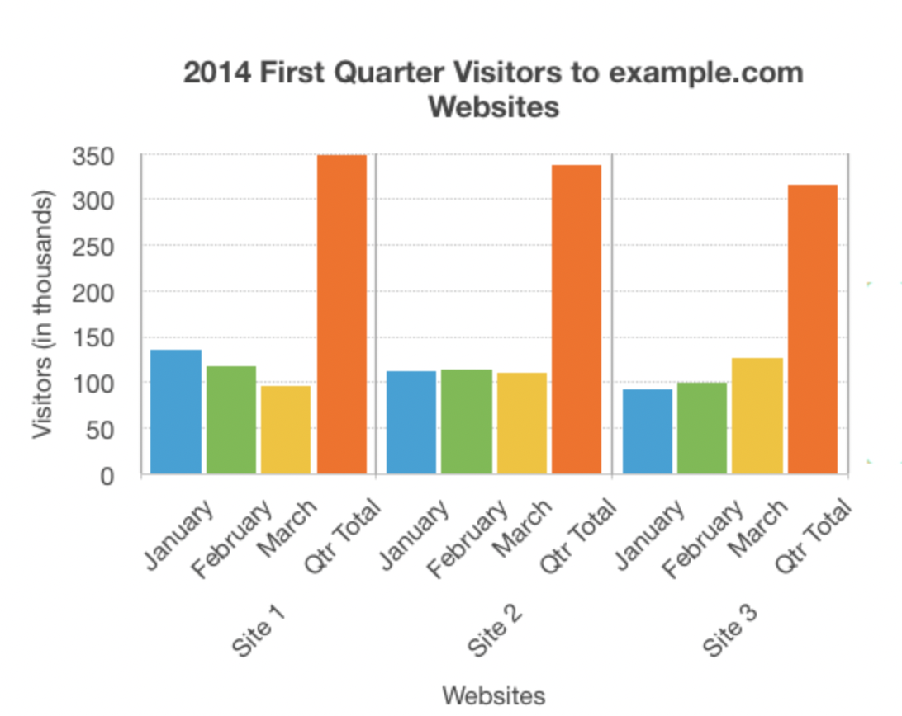
</figure>

대부분의 사용자들은 해당 정보를 문제없이 이해하고 파악할 수 있을 것이다. 하지만 컨텐츠에 접근성에 대한 고려가 되어있지 않다면 시각 장애인의 경우 해당 컨텐츠에 대해서 전혀 접근할 수 없기 때문에 아래와 같이 대체 텍스트가 제공되어야 한다는 것이다.

```html

<p class="a11y-hidden">Site 1 : January 140, ...</p>
```

이러한 방식으로 대체 텍스트를 제공해주어 `non-text content`에 대한 접근성을 확보해줄 수 있다.

## 1.2 충족 기준: Time-based Media

> Provide alternatives for time-based media.

사전 녹음된 오디오 및 비디오 콘텐츠에는 동등한 정보를 제공하는 시간기반 미디어에 대한 대체수단을 제공해야 한다. 그리고 자막을 제공해야 한다.

오디오, 동영상의 경우에는 시각 장애인과 청각 장애인 모두에게 접근성이 떨어진다. 따라서 오디오나 동영상의 경우에는 `track` 태그를 통해서 자막(텍스트)을 제공해주어야 한다.

> 1.2.4 자막, 1.2.5 오디오 설명, 1.2.7 확장형 오디오 설명 1.2.8 미디어 대체 수단, 1.2.9 오디오 전용에 대한 내용은 아래 내용들과 겹치는 부분이 많아 함께 설명했다.

### 1.2.1 충족 기준: 오디오전용 및 비디오전용 (사전 녹음 및 녹화)

- 사전 녹음된 오디오전용 및 사전 녹화된 비디오전용 미디어의 경우, 다음을 준수해야 한다.
  - 예외: 오디오 또는 비디오가 텍스트에 대한 미디어 대체수단이고, 대체수단임이 분명하게 명시된 경우

<figure>
  <figcaption>[ Sample Video ] (MDN)</figcaption>
  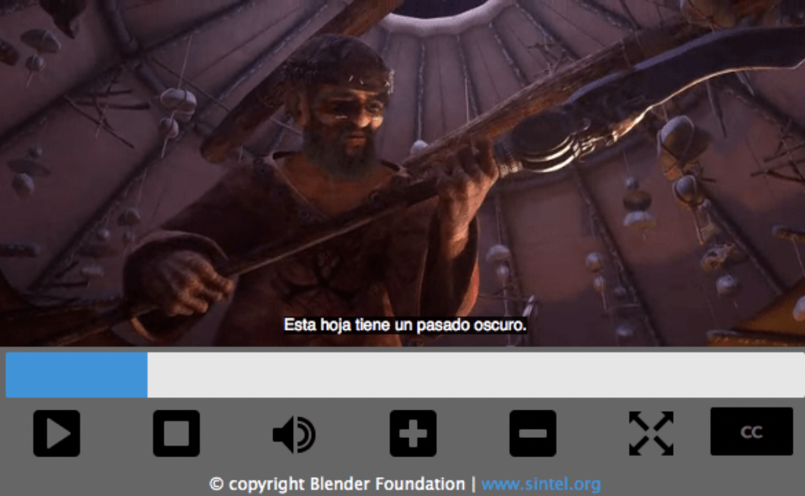
</figure>

예시 `html` 코드

```html
<video id="video" controls preload="metadata">
  <source src="example.mp4" type="video/mp4" />
  <source src="example.webm" type="video/webm" />
  <track
    src="sub_kr.vtt"
    kind="subtitles"
    srclang="ko"
    label="Korean"
    default
  />
  <track src="sub_en.vtt" kind="subtitles" srclang="en" label="English" />
  <track
    kind="descriptions"
    src="sampleDescriptions_en.vtt"
    srclang="en"
    label="English"
  />
  <track
    kind="descriptions"
    src="sampleDescriptions_ko.vtt"
    srclang="ko"
    label="Korean"
  />
</video>
```

### 1.2.2 충족 기준: 자막 (사전 녹음)

- 모든 사전 녹음된 오디오 콘텐츠에는 자막을 제공해야 한다.
  - 예외: 미디어가 텍스트에 대한 미디어 대체수단이고, 대체수단임이 분명하게 명시된 경우

<figure>
  <figcaption>[ Radio Caption ]</figcaption>
  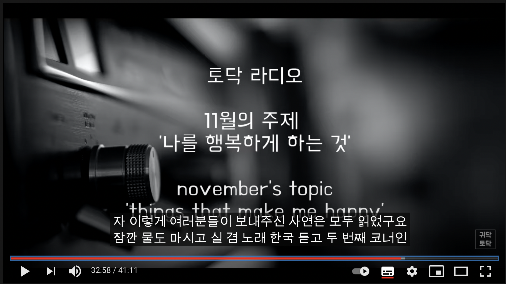
</figure>

위 Youtube 예시에서와 같이 라디오 등의 음성 녹음 미디어는 그 콘텐츠 내용에 해당하는 자막을 제공해야 한다.

`video` 혹은 `audio` 태그 내부에 `track` 태그로 자막 등을 설정해줄 수 있는데, 이러한 `track` 태그에는 다음과 같은 속성값들이 존재한다

- `captions`

  - 텍스트 트랙이 대화 및 음향 효과에 관한 것임을 명시함
  - 청각장애인을 위한 트랙에 적합

- `chapters`

  - 텍스트 트랙이 챕터의 제목임을 명시함.
  - 미디어 리소스의 탐색에 적합함

- `descripotions`

  - 텍스트 트랙이 비디오 콘텐츠에 대한 텍스트 설명임을 명시함.
  - 시각장애인을 위한 트랙에 적합함

- `metadata`

  - 텍스트 트랙이 스크립트에 사용되는 콘텐츠임을 명시하며, 사용자에게는 보이지 않음.

- `subtitles`
  - 텍스트 트랙이 비디오 콘텐츠의 자막임을 명시함.

따라서 적절한 속성값들을 적절히 활용해 접근성을 향상시켜야 한다.

### 1.2.3 충족 기준: 오디오 설명 또는 미디어 대체수단 (사전 녹화)

- 사전 녹화된 비디오 콘텐츠의 시간기반 미디어에 대한 대체수단 또는 오디오 설명을 제공해야 한다.
  - 예외: 미디어가 텍스트에 대한 미디어 대체수단이고, 대체수단임이 분명하게 명시된 경우

### 1.2.6 충족 기준: 수어 (사전 녹화)

- 모든 사전 녹음된 오디오 콘텐츠에는 수어 통역을 제공해야 한다.
  - 예외 없음

<figure>
  <figcaption>[ 수어 통역 ]</figcaption>
  
</figure>

자막 뿐만 아니라 수어 통역을 통해서 청각 장애인들이 이해하기 쉽도록 접근성을 고려해야 한다.

## 1.3 충족 기준: 적용성

> Create content that can be presented in different ways (for example simpler layout) without losing information or structure
>
> Make it easier for users to see and hear content including separating foreground from background.

간단히 요약하자면 정본, 구조 등이 손실없이 다른 방법들로 표현될 수 있도록 컨텐츠를 만들어야 한다는 것이다. 그리고 w3c - WCAG에 따르면 정보들은 색상, 크기 등의 시각적인 효과 등에만 의존하면 안되고, 화면의 가로나 세로 등의 특정 방향으로만 적용되면 안된다. 또한 사용자가 컨텐츠를 더 쉽게 볼 수 있도록 해야한다.

### 1.3.1 충족 기준: Info and Relationships

- 전달되는 정보, 구조, 관계는 텍스트로 이용 가능해야 한다.
  - 필수 입력란 등은 빨간색으로 표시되는 등 그 의미를 알 수 있도록 한다.

### 1.3.2 충족 기준: Meaningful Sequence

- 콘텐츠가 표시되는 순서가 의미에 영향을 미치는 경우, 올바른 읽기 순서는 프로그래밍 방식으로 결정되어야 한다.

<figure>
  <figcaption>[ Chart Color/Black ]</figcaption>
  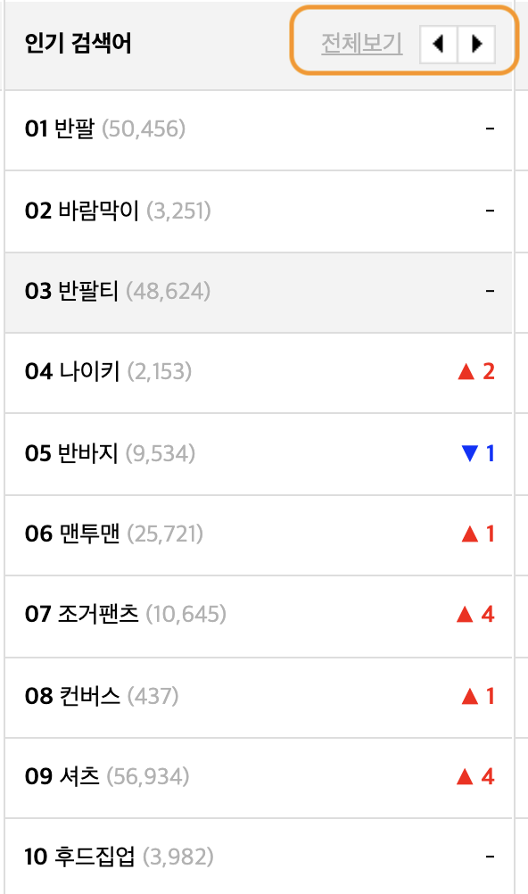
</figure>

위 그림에서 노란색 박스를 친 부분은 콘텐츠가 표시되는 순서에 맞게 마크업되어야 한다. 보통 tab 키를 사용하는 사용자 혹은 스크린 리더 등을 사용하는 보조기기 사용자들은 "인기 검색어"에 대해서 알아보고자 할 경우, "인기 검색어" 다음으로 인기 검색어 1위부터 10위 까지 먼저 본 후 전체 순위를 보는 것이 일반적이기 때문에 그 순서에 맞게 마크업을 하는 것이 좋다.

### 1.3.3 충족 기준: Sensory Characteristics

- 콘텐츠를 이해하고 작동하기 위해 제공된 지시문은 모양, 색상과 같은 구성요소의 시각적인 특성에만 의존해서는 안 된다.

<figure>
  <figcaption>[ Chart Color/Black ]</figcaption>
  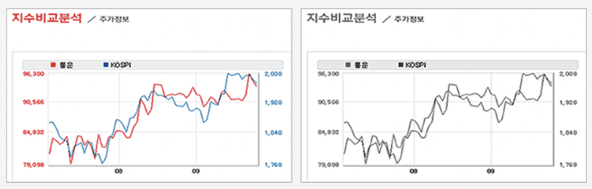
</figure>

예를 들어서 위 사진을 보면, 일반 사용자들은 빨간색과 파란색 선을 보고 차트를 이해하고 분석할 수 있지만 색깔을 구분하지 못하는 저시력자는 표을 이해하지 못해 제공되는 대체 텍스트를 보거나 보조기기를 활용해 내용을 파악해야할 것이다. 하지만 아래 표를 보자.

<figure>
  <figcaption>[ Chart Black ]</figcaption>
  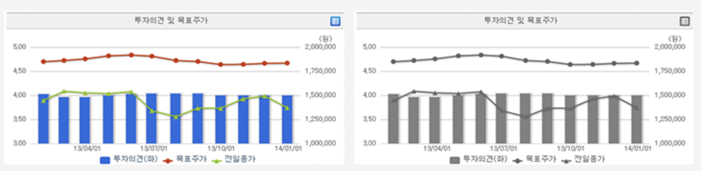
</figure>

해당 그래프는 색과 상관 없이 차트를 이해할 수 있도록 그림체가 명확히 다르기 때문에 위의 차트보다 접근성을 개선한 것을 확인할 수 있다. 이렇듯 그래프의 모양을 다르게 제공하여 그래프를 흑백처리해도 그래프 정보를 인식할 수 있는 등, 다양한 방법으로 컨텐츠에 접근할 수 있도록 해야한다. 그리고 아래 링크를 보자.

<figure>
  <figcaption>[ Link Sample ]</figcaption>
  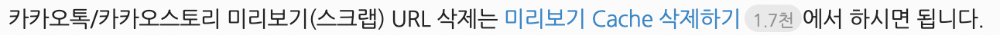
</figure>

위 문장을 보면 **"미리보기 Cache 삭제하기"** 에 파란색으로 링크가 걸린 것을 확인할 수 있다. 이러한 형태의 링크 설명은 인터넷 사용을 하면서 흔히 볼 수 있을 것이다. 하지만 위의 차트 예시와 마찬가지로 색을 구분하지 못하는 저시력자, 시각 장애인은 해당 텍스트가 링크인지 아닌지 전혀 알 길이 없다. 따라서 저렇게 표현되기 보다는

<figure>
  <figcaption>[ Link Sample (1) ]</figcaption>
  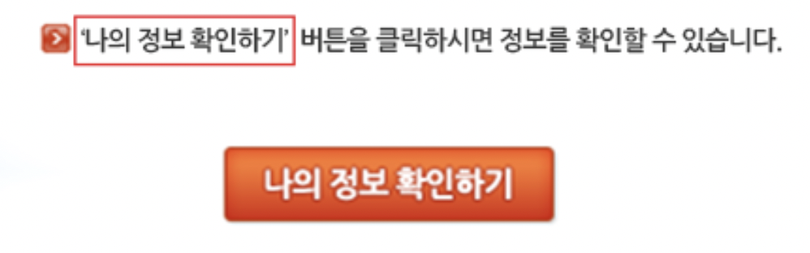
</figure>

위 예시와 같이 버튼을 확실하게 표현해주어 링크라는 것을 확실히 인식할 수 있도록 해주어야 한다.

### 1.3.4 충족 기준: Orientation

- 특정 디스플레이 방향이 필수적이지 않는 한, 콘텐츠는 세로 또는 가로와 같이 한 방향으로만 보거나 작동되도록 제한해서는 안 된다.

  - 방향이 필수적인 경우: 은행 수표, 피아노 애플리케이션, 프로젝터나 텔레비전용 슬라이드

<figure>
  <figcaption>[ 세로 모드 ]</figcaption>
  
</figure>

<figure>
  <figcaption>[ 가로 모드 ]</figcaption>
  
</figure>

위 예시처럼 방향이 필수적으로 고정되어 있어야 하는 경우를 제외하고는 가로와 세로모드 모두를 지원해야한다.

## 1.4 충족 기준: Distinguishable

> Make it easier for users to see and hear content including separating foreground from background.

> 1.4.6, 1.4.9, 1.4.11

### 1.4.1 충족 기준: Use of Color

- 색상은 정보 전달과 반응 유발, 시각적 요소 구별 등을 위한 시각적 수단으로만 사용되어서는 안 된다.
  - 즉, 색상을 사용할 때에는 해당 색으로써 어떠한 고유한 특정 의미를 가지고 사용되어야 한다는 것이다.

### 1.4.2 충족 기준: Audio Control

- 어떤 오디오가 3초 이상 자동으로 재생되는 경우, 일시정지 또는 중지할 수 있는 메커니즘 혹은 오디오 음량을 전체 시스템 음량 볼륨과는 별도로 제어할 수 있는 메커니즘을 제공해야 한다.

<figure>
  <figcaption>[ 오디오 자동 재생 ]</figcaption>
  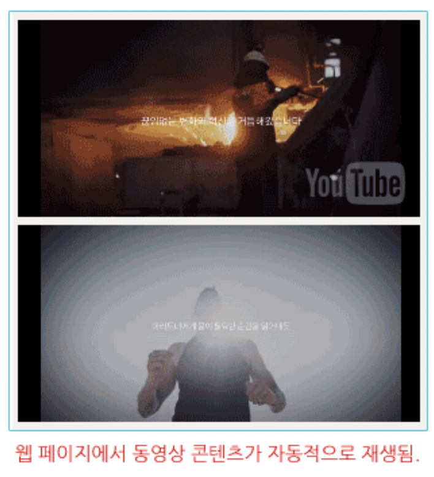
</figure>

<figure>
  <figcaption>[ 오디오 자동 재생 금지 ]</figcaption>
  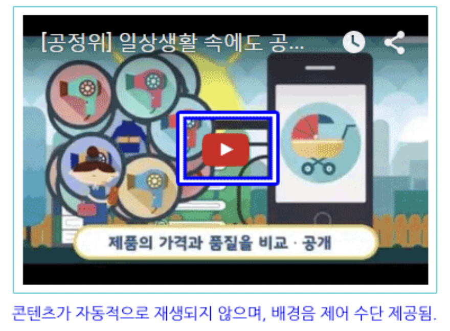
</figure>

### 1.4.3 충족 기준: Contrast (Minimum)

- 텍스트와 텍스트 이미지의 시각적 표현을 위한 명도대비율은 최소한 4.5:1 이상이 되어야 한다. 예외 사항은 아래와 같다.

  - **큰 텍스트** : 큰 텍스트와 텍스트 이미지의 명도대비가 최소한 3:1 이상이다.

  - **부수적인 텍스트**: 비활성 사용자 인터페이스 구성요소의 일부, 순수한 장식, 사용자에게 보이지 않는, 또는 의미있는 다른 시각적 콘텐츠를 포함하고 있는 그림의 일부인 텍스트 또는 텍스트 이미지에는 어떠한 명도대비 요구사항도 없다.

  - **로고**: 로고 또는 상표명에 포함된 텍스트에는 어떠한 명도대비 요구사항도 없다.

<figure>
  <figcaption>[ 명도 대비 ]</figcaption>
  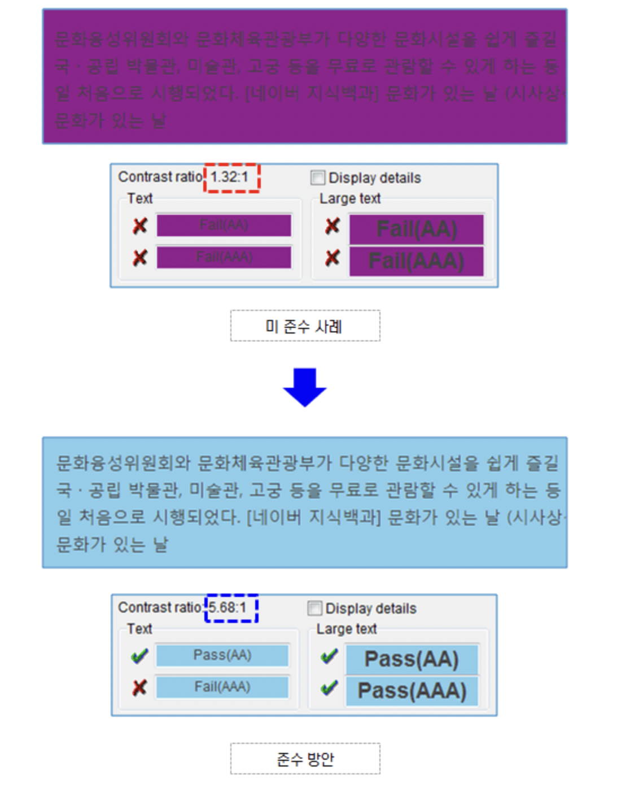
</figure>

### 1.4.4 충족 기준: Resize text

- 최대 200%까지 크기 조정이 가능해야 한다.
  - 예외: 자막과 텍스트 이미지

<figure>
  <figcaption>[ 텍스트 크기 조정 (전) ]</figcaption>
  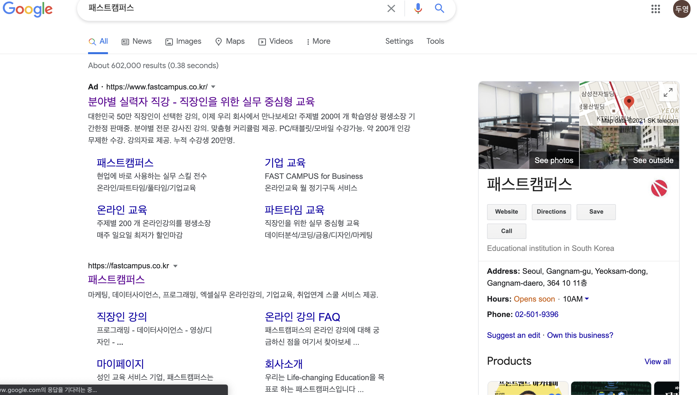
</figure>

<figure>
  <figcaption>[ 텍스트 크기 조정 (후) ]</figcaption>
  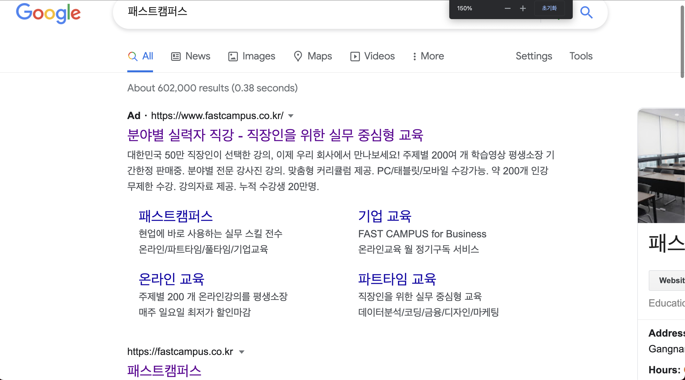
</figure>

### 1.4.5 충족 기준: Images of Text

- 정보는 텍스트 이미지보다 텍스트로 전달해야 한다. 예외는 아래와 같다.
  - **사용자 정의 가능한**: 텍스트 이미지가 사용자의 요구사항에 따라 시각적으로 사용자 정의 가능하다
  - **필수적인**: 텍스트의 특정 표현이 전달되는 정보에 필수적이다.

<figure>
  <figcaption>[ 텍스트 크기 조정 (후) ]</figcaption>
  
</figure>

### 1.4.7 충족 기준: Low or No Background Audio

- 음성이 주로 전경에 포함되어 있는 오디오 캡챠(CAPTCHA)나 오디오 로고가 아닌것, 그리고 사전 녹음된 오디오전용 콘텐츠는 다음 중 하나 이상을 준수해야 한다.

  - 배경음 없음(No Background)
    오디오는 배경음을 전혀 포함하고 있지 않아야 한다.

  - 배경음 끔(Turn Off)
    배경음을 끌 수 있어야 한다.

  - 20 dB
    단지 1~2초 동안만 지속되는 간헐적인 소리를 제외하고, 배경음은 전경 음성 콘텐츠보다 최소한 20dB 이상 낮아야 한다.

### 1.4.8 충족 기준: Visual Presentation

- 텍스트 블록을 시각적으로 표현하고자 하는 경우, 다음과 같은 것을 할 수 있는 메커니즘을 제공해야 한다.
  - 사용자가 전경색과 배경색을 선택할 수 있어야 한다.
  - 가로폭은 80자(한국어, 중국어, 일본어는 40자) 또는 글리프(glyph) 이하이어야 한다.
  - 텍스트는 양쪽 정렬을 해서는 안 된다(왼쪽과 오른쪽 여백에 정렬).
  - 줄 간격(leading)은 문단 내에서 최소 1.5배 이상되어야 하고, 문단 간격은 행 간격보다 최소 1.5배 이상이어야 한다.
  - 보조공학 없이도 전체 화면 창에서 텍스트 줄을 읽기 위해 수평으로 스크롤할 필요가 없도록 텍스트 크기를 최대 200%까지 조절할 수 있어야 한다.

### 1.4.10 충족 기준: Reflow

- 콘텐츠는 정보나 기능의 손실 없이, 그리고 다음의 경우에 대하여 2차원으로 스크롤할 필요 없이 제공되어야 한다.
  - 320 CSS 픽셀 너비의 세로 스크롤링 콘텐츠
  - 256 CSS 픽셀 높이의 가로 스크롤링 콘텐츠

활용상 또는 의미상 2차원적인 레이아웃이 필요한 콘텐츠는 예외로 한다.

### 1.4.12 충족 기준: Text Spacing

- 다음의 텍스트 스타일 속성을 지원하는 마크업 언어를 사용하여 구현된 콘텐츠의 경우, 다음과 같은 것을 모두 설정한 후 추가적인 스타일 속성의 변경 없이도 콘텐츠나 기능에 손상이 없어야 한다.

  - 줄 높이(줄 간격)가 글자 크기보다 최소한 1.5배 이상
  - 문단 간격이 글자 크기보다 최소한 2배 이상
  - 글자 간격(tracking)이 글자 크기보다 최소한 0.12배 이상
  - 단어 간격이 글자 크기보다 최소한 0.16배 이상

### 1.4.13 충족 기준: Content on Hover or Focus

- 마우스 포인터로 가리키거나(hover) 키보드 포커스(focus)를 받은 다음 이를 제거했을 때 추가 콘텐츠가 보였다가 사라지도록 하는 경우, 다음을 준수해야 한다.

  - 해제 가능 (Dismissable)
    추가 콘텐츠가 입력 오류를 전달하거나 다른 콘텐츠를 숨기거나 바꾸지 않는 한, 마우스 포인터로 가리키거나 키보드 포커스를 이동하지 않고 추가 콘텐츠를 해제할 수 있는 메커니즘을 제공해야 한다.
  - 마우스 포인터로 가리킬 수 있는(Hoverable)
    마우스 포인터로 가리켜 추가 콘텐츠를 보여줄 경우, 포인터는 콘텐츠가 사라지지 않게 하면서 그 콘텐츠 위로 이동할 수 있어야 한다.
  - 지속적인(Persistent)
    추가 콘텐츠는 마우스 포인터로 가리키거나 키보드 포커스 트리거(trigger)가 제거되거나, 사용자가 해제하거나, 정보가 더 이상 유효하지 않을 때까지 볼 수 있어야 한다.

<figure>
  <figcaption>[ 텍스트 크기 조정 (후) ]</figcaption>
  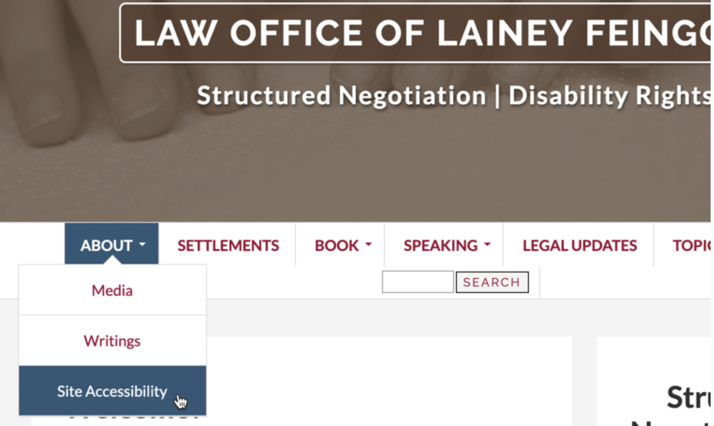
</figure>

위 그림은 마우스 포인터로 네비게이션 바의 서브 메뉴에 호버했을 때 상황을 보여준다. 호버하는 동안 메뉴가 계속 보이기 때문에 사용자는 보고 싶은 만큼 이를 확인할 수 있다. 그리고 마우스는 다른 컨텐츠에 또다시 호버하여 새로운 컨텐츠를 확인하거나 esc키 등을 눌러 컨텐츠 확인을 종료할 수 있다.

## Reference

- seulbinim github

  - https://seulbinim.github.io/WSA/embedded.html

- MDN

  - https://developer.mozilla.org/en-US/docs/Web/HTML/Element/track
  - https://developer.mozilla.org/en-US/docs/Learn/Accessibility/Multimedia

- W3C

  - https://www.w3.org/WAI/tutorials/images/complex/
  - https://www.w3.org/WAI/WCAG21/Understanding/audio-only-and-video-only-prerecorded.html
  - https://www.w3.org/WAI/WCAG21/Understanding/captions-prerecorded.html

- web seoul

  - http://www.websoul.co.kr/

- waulab

  - https://waulab.tistory.com/
