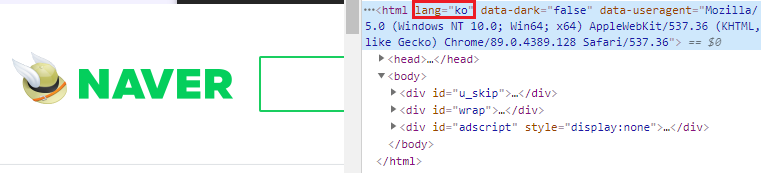
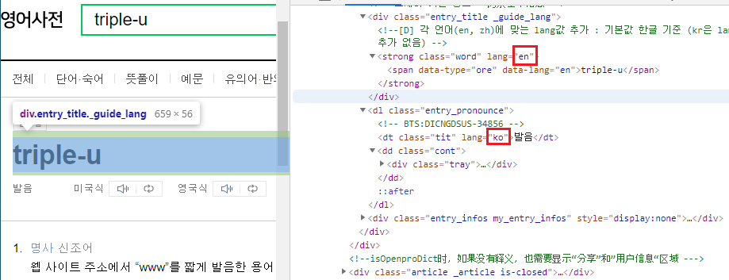
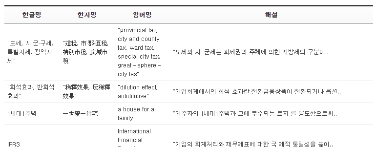
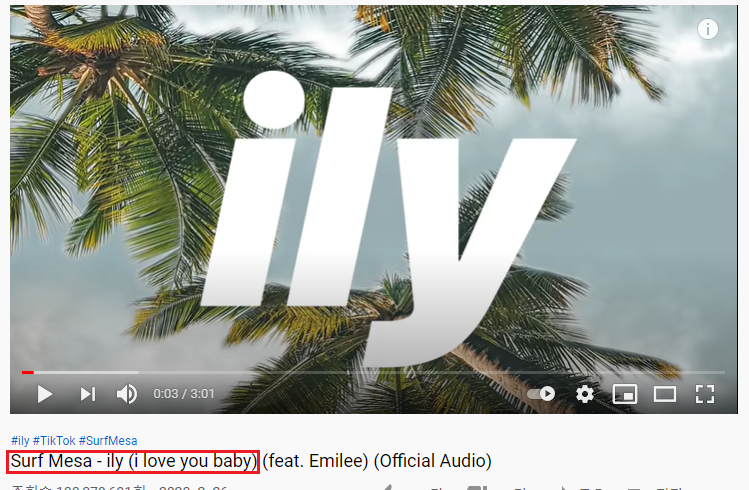
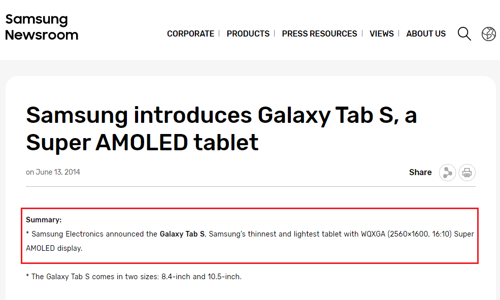
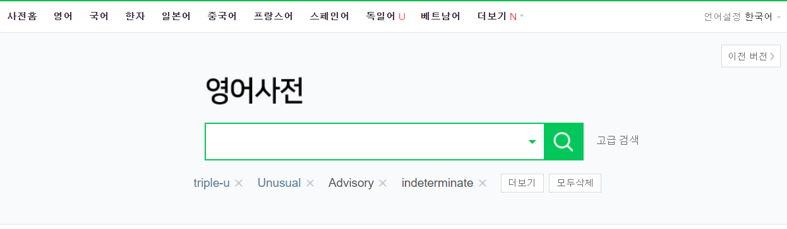
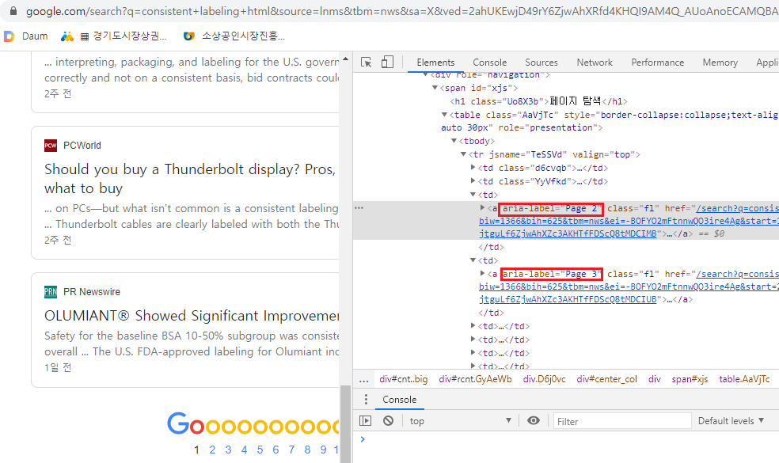
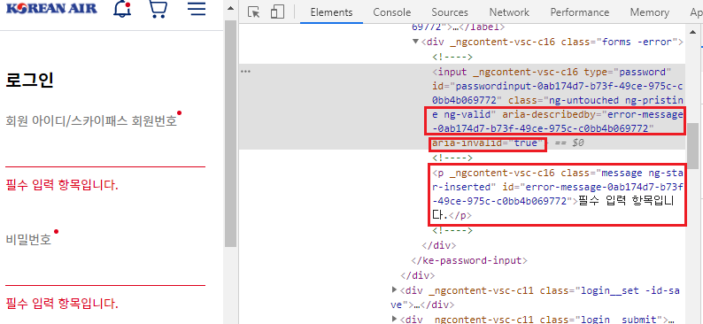
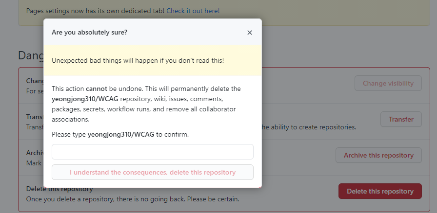
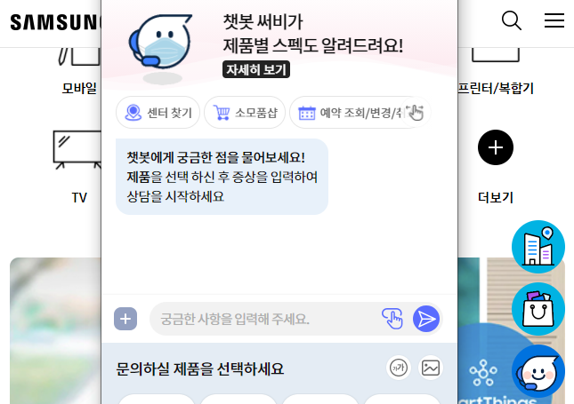

# Part 3. 이해의 용이성(Understandable)

## 이 글의 목적와 순서

이 글에서는 Accessibility Guidelines Working Group에서 발행한 WCAG(Web Content Accessibility Guidelines) 중 세 번재 주제인 '이해의 용이성(Operable)'의 내용을 정리하고 해당 가이드라인을 잘 준수한 웹 사이트를 사례로 소개하려고 한다. 이 글은 다음 순서로 전개해가고자 한다.

1. WCAG 중 이해의 용이성(understandable)을 준수하기 위한 기준 소개
2. 각 기준을 준수한 웹 사이트 소개


## 1. WCAG 중 이해의 용이성(Understandable) 내용 소개
이해의 용이성은 웹 페이지를 이용하는 사용자가 UI와 정보를 쉽게 이해하고 운용할 수 있음을 의미한다. 이해의 용이성이라 함은 장애가 없는 일반인의 입장에서는 물론 시각, 청각, 지적 장애 등을 가지고 있는 장애인의 입장에서도 웹 페이지의 구성요소들을 **이해**할 수 있어야 한다는 것이다. WCAG에서는 이해의 용이성을 평가하는 기준을 다음과 같이 3가지로 제시하고 평가의 단계를 세 가지(A, AA, AAA)로 구분한다.

- 글의 가독성(Readable)
- 예측 가능한 조작(Predictable)
- 입력 지원(Input Assistance)

### 2.1 평가 기준 1 - 글의 가독성(Readable)

#### 2.1.1 충족기준 

#### 1. 페이지의 언어(Language of Page) - A
어떤 언어를 사용했는지 올바르게 표기하여 사용자 에이전트가 페이지에 표기된 언어를 바르게 읽을 수 있도록 한다. 이 기법은 보조 기기를 사용해 메세지를 전달받는 사용자도 올바른 정보를 전달받을 수 있게 한다.

#### 사례

<figure>
    <figcaption>
        <cite><a href="https://www.naver.com">html 태그 내에 lang 속성 사용</a> - by NAVER</cite>
    </figcaption>
    
</figure>

#### 2. 부분 언어(Parts of Language) - AA
사용된 단어 자체가 적절한 경우, 전문 용어, 불확실한 단어, 모국어의 방언을 사용하는 경우를 제외하고 페이지 내에서 여러 언어를 사용한 경우에도 보조 기기가 콘텐츠를 알맞은 언어로 해석할 수 있어야 한다. 즉 여러 언어를 사용했다면 부분적으로 해당 언어를 표기해야 한다.


#### 적용가능 기술:
- [H58](https://www.w3.org/WAI/WCAG21/Techniques/html/H58.html): lang 속성을 사용해 특정언어 기제
- [SL4](https://www.w3.org/WAI/WCAG21/Techniques/html/H57.html): HTML의 DOM이 언어를 부분적으로 지정하도록 silverlight object 선언

#### 사례 - H58

<figure>
    <figcaption>
        <cite><a href="https://en.dict.naver.com/#/entry/enko/b329d0e24f9b4de1af1f7eb9ad023966">영어 사전에서 lang 속성을 부분적으로 사용한 예시 - </a>
        by NAVER
    </figcaption>
    
</figure>

#### 3. 생소한 단어(Unusual words) - AAA
방언이나 전문 용어와 같은 특수한 언어나 구절을 인지할 수 있는 메커니즘을 제공해야 한다.

#### 적용가능 기술
- Situatino A: 동일한 웹페이지에서 용어가 가지는 의미가 유일한 경우
    - [H40](https://www.w3.org/WAI/WCAG21/Techniques/html/H40.html): dl(description lists) 태그로 본 뜻의 정의하고 링크를 연결한다.
    - [H54](https://www.w3.org/WAI/WCAG21/Techniques/html/H54.html): 컨텐츠 내에서 dfn 태그를 사용해 정의를 제공한다.
    - [G62](https://www.w3.org/WAI/WCAG21/Techniques/general/G62.html): 용어사전을 제공한다.
    - [G70](https://www.w3.org/WAI/WCAG21/Techniques/general/G70.html): 용어를 검색할 수 있는 메카니즘을 제공한다.
- Situation B: 동일한 페이지 내에서 용어가 가지는 의미가 여러개인 경우
    - H40
    - H54

#### 사례 - G62
<figure>
    <figcaption>
        <cite><a href="https://txsi.hometax.go.kr/docs/customer/dictionary/wordList.jsp">특수 용어사전을 메커니즘으로 제공 </a> -
        by 홈텍스
    </figcaption>
    
</figure>

#### 4. 약어(Abbreviations) - AAA
약어의 발음만 듣고 뜻을 인지하지 못하는 경우가 많기 때문에 의미를 인지할 수 있는 메커니즘을 제공해야 한다.

#### 적용가능 기술
- Situation A: 동일한 웹페이지에서 약어가 가지는 의미가 유일한 경우
    - [G97](https://www.w3.org/WAI/WCAG21/Techniques/general/G97.html): 확장가능한 형태로 약어의 본 뜻을 해설한다.
    - [G55](https://www.w3.org/WAI/WCAG21/Techniques/general/G55.html): 용어의 본 뜻을 설명하는 링크를 연결한다.
    - [H28](https://www.w3.org/WAI/WCAG21/Techniques/html/H28.html): abbr 태그를 사용해 본 뜻을 해설한다.
    - [G62](https://www.w3.org/WAI/WCAG21/Techniques/general/G62.html): 용어사전을 제공한다.
    - [G70](https://www.w3.org/WAI/WCAG21/Techniques/general/G70.html)용어를 검색할 수 있는 메카니즘을 제공한다.
- Situation A: 동일한 웹페이지에서 약어가 가지는 의미가 여러 개인 경우
    - G55
    - H28

#### 사례 - G97
<figure>
    <figcaption>
        <cite><a href="https://txsi.hometax.go.kr/docs/customer/dictionary/wordList.jsp">확장가능한 형태의 폼으로 약어의 본 뜻을 해설</a> - by Youtube
    </figcaption>
    
</figure>

#### 5. 독해 수준(Reading Level)
콘텐츠는 최대한 간단 명료하게 작성해야 하고, 만약
중학교 수준 이상의 독해능력이 필요한 경우는 충분히 해설가능한 보충 콘텐츠를 제공해야 한다. 이는 독서 장애를 가진 사람들을 돕고. 저자가 풀이하기 어려운 콘텐츠를 비교적 쉽게 이해할 수 있도록 한다.

#### 적용가능 기술:
- [G86](https://www.w3.org/WAI/WCAG21/Techniques/general/G86.html): 이해하기 어려운 복잡한 텍스트를 대신해 쉽게 이해할 수 있는 짧은 요약본으로 제공한다.
- [G103](https://www.w3.org/WAI/WCAG21/Techniques/general/G103.html): 아이디어, 이벤트, 프로세스를 설명하는데 도움이 되는 시각적인 그림 및 기호를 제공한다.
- [G79](https://www.w3.org/WAI/WCAG21/Techniques/general/G79.html): 오디오 형식으로 콘텐츠를 제공한다.
- [G153](https://www.w3.org/WAI/WCAG21/Techniques/general/G153.html): 텍스트를 읽기 쉽게 작성한다.
    - 단락당 주제를 설정한다.
    - 긴 문장을 사용하지 않는다.(영어 기준 25단어)
    - 긴 문장을 두개의 문장으로 나눈다.
    - 두개 이상의 접속사를 한 문장에 사용하지 않는다.
    - 전문 용어, 은어 및 명확하지 의미의 용어는 피한다.
    - 의미가 변하지 않는다면 중복된 단어를 제거한다.

#### 사례 - G86

<figure>
    <figcaption>
        <cite><a href="https://news.samsung.com/global/samsung-introduces-galaxy-tab-s-a-super-amoled-tablet">삼성 뉴스 페이지의 요약본 제공</a> - by Samsung
    </figcaption>
    
</figure>

#### 6. 발음(Pronunciation) - AAA
약어와 같이 그 특수한 발음을 알지 못하면 단어의 의미를 알기 힘든 경우에 이 문제점을 해결할 수 있는 메커니즘을 제공해야 한다.

#### 적용가능 기술:
- [G120](https://www.w3.org/WAI/WCAG21/Techniques/general/G120.html): 웹페이지 내에서 최소한 단어의 첫 등장시에 한번은 사용자가 이해가능한 발음을 제공한다. 단, 철자는 같지만 발음이 다른 단어가 포함된 경우 이 기술은 부적절 하다.
- [G121](https://www.w3.org/WAI/WCAG21/Techniques/general/G121.html): 발음을 들을 수 있는 링크를 제공한다.
- [G62](https://www.w3.org/WAI/WCAG21/Techniques/general/G62.html): 발음을 들을 수 있는 용어 사전을 제공한다.
- [H62](https://www.w3.org/WAI/WCAG21/Techniques/html/H62.html): ruby 태그를 통해 발음을 제공한다.
```
<ruby>
    <rb>WCAG</rb>
    <rp>(</rp>
        <rt>Wuh-KAG</rt>
    <rp>)</rp>
</ruby>
```

#### 사례

### 2.2 평가 기준 2 - 예측 가능한 조작(Predictable)
웹 페이지는 예측 가능한 방식으로 동작해야 한다.

#### 2.2.1 충족기준

#### 1. 포커스 시(On Focus) - A
사용자 인터페이스에서 구성요소에 포커스 되었을 때, 화면이 갑자기 이동하는 등 맥락이 변경되어서는 안된다. 이는 유저가 문서 내부에서 콘텐츠를 이동할 때 예측가능한 범위로 이동하여 혼란을 방지하기 위함이다. 

예시
- 폼 요소가 포커스를 받았을 때 자동으로 제출되지 않아야 한다. 
- 구성 요소가 포커스를 받았을 때 새창이 실행되면 안된다. 
- 구성 요소가 포커스를 받았을 때 다른 구성 요소로 변경되면 안된다. 

#### 적용가능 기술:
- [G107](https://www.w3.org/WAI/WCAG21/Techniques/general/G107.html) :`:focus` 가상 클래스 선택자를 사용하는 것 보다, `:active` 가상 클래스 선택자를 사용한다. - 문맥의 변경이 포커스와 무관하며 사용자의 클릭에 의해서만 문맥을 변경한다.

> 참고 1
> 문맥의 변경이란 새창이 띄워지거나 문맥의 흐름이 갑자기 변경되는 것 처럼 전체 페이지를 동시에 볼 수 없는 사용자가 문맥의 변경을 인식하지 못하는 경우를 말한다. 

> 참고 2
> 유저 에이전트, 뷰포트, 포커스 이 세가지 모두 문맥의 변경에 포함된다.

> 참고 3
> 콘텐츠의 변경이 항상 문맥의 변경과 일치하는 것은 아니다. 아웃라인의 확장, 메뉴의 확장, 정상적인 탭 컨트롤에 의한 문맥 이동이 참고 2번을 변경하지 않는한 정상적인 흐름으로 간주한다.

#### 사례

#### 2. 입력 시(On Input) - A
데이터를 입력하거나 입력 폼과 같이 구성 요소를 사용자가 직접 설정하고 변경하는 경우에도 사용자의 의도와 상관없이 문맥이 변경되어서는 안된다.

#### 적용가능 기술:
- [G80](https://www.w3.org/WAI/WCAG21/Techniques/general/G80.html): 제출 버튼을 삽입한다.
- [H84](https://www.w3.org/TR/2016/NOTE-WCAG20-TECHS-20161007/H84): select 요소를 사용해서 사용자의 클릭에 의해 기능이 수행되도록 한다.

> 참고 1
> onchange 이벤트를 통해 폼 내부의 요소가 변경되면 자동으로 제출되도록 유도하는 경우가 부적합한 사례라고 볼 수 있다.

#### 사례

#### 3. 일관된 네비게이션(Consistent Navigation) - AA
페이지마다 반복되는 네비게이션 메뉴는 모든 페이지에서 동일한 순서로 제공되어야 한다. 이 기법은 반복되는 구성 요소에 대한 경험을 축적시켜 익숙한 환경을 만들어주기 위함이다. 단, 사용자가 네비게이션 순서를 변경한 경우는 제외한다.

#### 적용가능 기술:
- [G61](https://www.w3.org/WAI/WCAG21/Techniques/general/G61.html): 모든 페이지에 동일한 순서의 메뉴를 제공

#### 사례

<figure>
    <figcaption>
        <cite><a href="https://en.dict.naver.com/#/main">동일한 네비게이션 예시</a> - by NAVER
    </figcaption>
    
</figure>

#### 4. 일관된 식별(Identification) - AA
동일한 기능을 수행하는 구성요소들은 사용자가 반복되는 패턴을 기억할 수 있도록 동일한 패턴의 이름을 설정한다.

#### 적용가능 기술:
- [G197](https://www.w3.org/WAI/WCAG21/Techniques/general/G197.html): label, name 속성, text의 alt속성을 일관되게 작성한다.
    - 각 페이지 링크를 page 1, page 2 ... 와 같이 일관된 패턴으로 작성한다.
    - 서로 다른 페이지에서 같은 기능을 수행하는 두 개의 탐색 버튼을 search와 find로 나누지 않고 통일한다.
    - 동일한 기능을 가지며, 동일한 text를 삽입한 두 개의 버튼에 aria-label을 다르게 설정한 경우 스크린 리더 사용자는 이를 다른 기능으로 인식할 가능성이 높다.
    
#### 사례

<figure>
    <figcaption>
        <cite><a href="https://www.google.com/search?q=fastcampus">일관된 label 작성 예시</a> - by Google
    </figcaption>
    
</figure>

#### 5. 요구에 의한 변경(Change on Request) - AAA
페이지 전체에 걸쳐 사용자의 요청에 의해서만 맥락이 변경될 수 있도록 설계한다. 동시에 이 설정을 해제할 수 있는 메커니즘을 제공해야 한다. 

#### 적용가능 기술:
- Situation A: 웹 페이지가 자동 업데이트되는 경우
    - [G76](https://www.w3.org/WAI/WCAG21/Techniques/general/G76.html): 콘텐츠를 새롭게 업데이트해야 할 경우, 사용자에게 업데이트된 사실을 알리고 사용자의 필요에 따라 업데이트 되는 메커니즘을 제공한다.
        - 컨텐스트를 자동으로 갱신하는 뉴스 페이지처럼 주기적으로 새로고침이 일어나는 경우 보조 기기를 이용하는 사용자는 방향을 잃게 된다. 따라서 업데이트 버튼을 통해 페이지가 갱신되도록 한다.
        - ajax 처럼 새로운 데이터를 비동기로 빈번하게 업데이트 하는 경우 업데이트가 사용자의 권한을 벗어나기 때문에 혼란을 야기할 수 있다. 이런 경우에도 데이터를 갱신하는 버튼을 제공해야 한다.

- Situation B: 페이지가 자동으로 리디렉트 하는 경우 
    - [SVR1](https://www.w3.org/WAI/WCAG21/Techniques/server-side-script/SVR1.html) 클라이언트 사이드 대신 서버 사이드에서 리디렉션을 구현한다.
        - 클라이언트 사이드에서 리디렉션을 구현하게 되면 브라우저가 HTML 문서를 받아서 리디렉션을 해야하는지 알기까지 일정 시간이 소요된다. 그 시간 내에 콘텐츠가 표기되면 문맥을 읽어가는 도중에 새로운 페이지로 리디렉션되기 때문에 사용자가 혼란스러울 수 있다.
    - [H76](https://www.w3.org/WAI/WCAG21/Techniques/html/H76.html): 서버 사이드 제어 권한이 없어서 클라이언트 사이드의 meta 태그를 사용해 리디렉션을 해야하는 경우에는 content를 0 으로 설정해서 메타 태그를 읽는 즉시 리디렉션하도록 설정한다.
- Situation C: 웹페이지가 팝업을 사용하는 경우
    - [H83](https://www.w3.org/WAI/WCAG21/Techniques/html/h83.html): 팝업대신 target을 _black로 설정해서 사용자의 권한 아래 새 창이 열리도록 설정한다. target 속성을 지원하지 않는 경우에는 ecmascrpit를 통해 사용자에게 새창이 열릴 것임을 알리고 이벤트가 동작하면 새창이 열리게 설정한다.

#### 사례

### 2.3 평가 기준 3 - 입력 지원
사용자의 실수를 회피하거나 수정할 수 있도록 지원해야 한다.

#### 2.3.1 충족기준 

#### 1. 오류 식별(Error Identification) - A
입력 오류가 감지되면, 오류를 일으킨 항목을 식별해서 오류 메세지를 사용자에게 전달합니다.
#### 적용가능 기술:
- Situation A: 폼 내부에 필수로 작성해야 하는 구성 요소가 있는 경우
    - [G83](https://www.w3.org/WAI/WCAG21/Techniques/general/G83.html): text로 작성되지 않은 필수 구성 요소가 있음을 알려준다.
    - [ARIA21](https://www.w3.org/WAI/WCAG21/Techniques/aria/ARIA21.html)aria-required를 기제하거나, 더 복잡한 로직이 필요한 경우 aria-invalid 속성을 기제한다.
        - aria-invalid를 통해 에러 메세지를 보내고 싶은 경우, [aria-describedby](https://nuli.navercorp.com/community/article/1132700?email=true) 속성에 특정 id 값을 삽입하여 해당 id 요소에 설정한 텍스트를 읽어줄 수 있도록 설계한다. 또는 aria-errormessage 속성을 사용해 aria-invalid가 true인 경우에 에러 메세지를 노출할 수 있다.
    - alert 함수를 사용해서 사용자 에이전트가 에러 메세지를 읽을 수 있게 한다.
- 특정한 형식의 데이터 혹은 값을 작성해야하는 경우
    - role을 [alertdialog](https://www.w3.org/WAI/WCAG21/Techniques/aria/ARIA18.html)로 설정한 에러메세지를 모달로 통지합니다. 
        - 이 모달이 어떤 의미인지 알려주기 위해 aria-label 또는 aria-labelledby 속성을 포함해야 합니다.
        - aria-describedby를 설정해서 상세한 내용을 전달할 수 있습니다.
        - alertdialog 내부에 포커스 가능한 요소를 반드시 포함해야하며 모달이 열렸을 때 포커스가 그 요소로 이동해야 합니다.(동의, 닫기 등)
        - 가능하면 alertdialog가 사라졌을 때 원래 포커스로 이동해야 합니다.
    - 단순히 에러메세지를 전달하고 싶은경우 role을 alert로 설정할 수 있습니다.
    - aria-invalid와 aria-errormessage 속성을 사용해 에러 메세지를 읽어준다.
    - text로 충분히 이해할 수 있는 설명을 해준다.
    - alert 함수를 사용해서 사용자 에이전트가 에러 메세지를 읽을 수 있게 한다.
#### 사례

<figure>
    <figcaption>
        <cite><a href="https://www.koreanair.com/login">aria-invalid, aria-describedby를 사용한 에러메세지 전달</a> - by 대한항공
    </figcaption>
    
</figure>

#### 2. 레이블 또는 지시문(Labels or Instructions) - A
사용자가 입력해야하는 구성 요소가 있는 경우, 해당 요소가 어떤 의미인지 알려주기 위해 label 태그를 사용하거나 지침을 제공해야한다.
#### 적용가능 기술:
- [G131](https://www.w3.org/WAI/WCAG21/Techniques/general/G131.html):입력 구성 요소와의 관계를 설명할 수 있는 label을 제공한다.
    - [ARIA1](https://www.w3.org/WAI/WCAG21/Techniques/aria/ARIA1.html): 상세한 설명이 필요한 경우 aria-describedby 속성을 기제해 해당 구성 요소에 대한 상세 메세지를 전달한다.
    - [ARIA9](https://www.w3.org/WAI/WCAG21/Techniques/aria/ARIA9.html): 간단한 설명이 필요한 경우에는 aria-labelledby 속성을 기제해 해당 구성 요소에 대한 메세지를 전달한다.
        - 단어처럼 매우 간단하게 label을 제공하고 싶은경우 aria-label 속성에 원하는 설명을 작성할 수 있다. 단 aria-labelledby 속성의 우선순위가 더 높기 때문에 두 속성 모두가 사용된 경우 aria-labelledby를 설명한다.
    - [ARIA17](https://www.w3.org/WAI/WCAG21/Techniques/aria/ARIA17.html): 공통된 label을 설정해야 하는 경우에는 role을 group으로 설정하고 label 속성을 삽입한 후 그 내부에 요소들을 삽입할 수 있다.
    - 입력 형식을 text로 제공한다.
    - text로 label을 삽입해서 유저 에이전트가 입력 구성 요소와의 관계를 읽어줄 수 있게 설정한다.
    - form 내부에 fieldset으로 구역을 나누고 legend에 required를 텍스로 삽입한다.

#### 3. 오류 수정 제안(Error Suggestion) - AA
입력 오류를 감지했을 때 보안상 문제가 없는 선에서 사용자에게 수정안을 제시한다.

#### 적용가능 기술:
- 필수로 작성해야하는 구성 요소에 아무 정보도 입력하지 않은 경우.
    - 입력해야 할 구성요소가 남아있다는 것을 text로 설명한다.
    - aria-required 속성을 사용한다.
- 특정한 형식의 데이터 혹은 값을 작성해야하는 경우
    - role을 [alertdialog](https://www.w3.org/WAI/WCAG21/Techniques/aria/ARIA18.html)로 설정하고 수정안을 모달로 제공합니다. 세부사항은 오류 식별에서 설명한 방법과 같습니다.
    - 수정안을 text로 제공합니다.
    - alert 함수를 사용해서 수정안을 제공한다.

- 정해진 값의 집합중 하나를 꼭 입력해야 하는 경우
    - role을 [alertdialog](https://www.w3.org/WAI/WCAG21/Techniques/aria/ARIA18.html)로 설정하고 집합을 모달로 제공합니다. 세부사항은 오류 식별에서 설명한 방법과 같습니다.
    - 수정안(집합)을 text로 제공합니다.
    - alert 함수를 사용해서 수정안집합)을 제공한다.

#### 4. 오류 예방 - 법률, 금융, 데이터(Error Prevention - Legal, Financial, Data) - AA
사용자에 대한 법률을 이행하해야 하고, 금융 거래가 발생하거나, 데이터 스토리지에서 사용자가 제어 가능한 데이터를 수정 또는 삭제하거나, 사용자의 테스트를 제출하는 웹페이지의 경우, 적어도 다음 중 하나를 준수 해야한다.

- Reversible: 제출 사항을 되돌릴 수 있어야 한다.
- Checked: 사용자가 입력한 데이터는 오류 사항을 점검할 수 있어야하고, 사용자가 입력 데이터를 수정할 수 있는 기회를 제공해야 한다.
- Comfirmed: 제출하기 전에 올바른 정보인지 확인하고 검토할 수 있는 메커니즘을 제공해야 한다.

#### 적용가능 기술:
- 소득세를 신고하거나 물품을 구입하는 것 처럼 법접인 거래가 발생하는 경우
    - 해당 웹 페이지는 취소 가능 절차를 충분히 설명해야한다.
    - 해당 웹 페이지는 제출 사항을 수정할 수 있는 메커니즘을 제공해야 한다.
    - 제출전 검토할 수 있는 요약페이지를 제공한다.
- 정보가 삭제되는 경우
    - 복구할 수 있는 기능을 제공한다.
    - 정말 이 동작을 이행해도 되는지 사용자의 동의를 얻는 최종 확인 단계를 마련한다.
    - checkbox를 클릭해야 제출이 가능하도록 한다.

#### 사례

<figure>
    <figcaption>
        <cite><a href="https://www.github.com">데이터 삭제전 동의 여부</a> - by github
    </figcaption>
    
</figure>

#### 5. 도움말(Help) - AAA
사용자가 현재 작업중인 내용을 직접적으로 살펴보지 않고도 상황에 맞는 도움말을 통해 작업을 수행할 수 있게 한다. 상황별 도움말은 label이 기능을 충분히 설명하지 못하는 경우 제공한다.

#### 적용가능 기술:
- 모든 웹 페이지에 도움말 링크를 제공한다.
- AI 챗봇과 같이 도움을 줄 수 있는 보조장치를 제공한다.
- 
#### 사례
<figure>
    <figcaption>
        <cite><a href="https://www.samsungsvc.co.kr/">챗봇 서비스</a> - by Samgung
    </figcaption>
    
</figure>

#### 6. 오류 예방 - 전체(Error Prevention - All) - AAA
장애를 가진 사용자는 일반 사용자보다 더 많은 실수를 유발할 수 있다. 따라서 사용자가 정보를 제출해야 하는 경우 다음 중 하나 이상을 준수해야 한다.
- Reversible: 제출 사항을 되돌릴 수 있어야 한다.
- Checked: 사용자가 입력한 데이터는 오류 사항을 점검할 수 있어야하고, 사용자가 입력 데이터를 수정할 수 있는 기회를 제공해야 한다.
- Comfirmed: 제출하기 전에 올바른 정보인지 확인하고 검토할 수 있는 메커니즘을 제공해야 한다.


#### 참고자료:

- [Aria-controls](https://nuli.navercorp.com/community/article/1132879?email=true)
- [WCAG 2.1](https://a11y.gitbook.io/wcag/) 

- [WAI-ARIA 가이드라인](https://github.com/lezhin/accessibility/blob/master/aria/README.md#status)

- [google-aria](https://developers.google.com/web/fundamentals/accessibility/semantics-aria/hiding-and-updating-content?hl=ko)

- [WCAG 2.1](https://www.w3.org/TR/WCAG21/) 